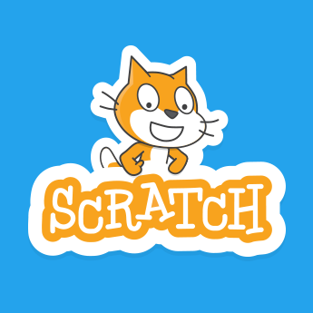

# CodeEDU
<html>
<body background="depositphotos_52533505-stock-illustration-neutral-background.jpg">
</body>
</html>
<html>
  <h3>CodeEDU is a website built for fast python and html learning, no sign up needed and its free! no downloads requiered, just start programming in your browser</h3>
</html>

<html>
<body>

start programming python(built in IDE: ----->

</body>
</html>

<html>
<body>

start programming scratch ----------------->

</body>
</html>

<html>
<body>

 start programming HTML(built in IDE): ------> 

</body>
</html>
<h3>This site does not make money with ads and can only stay up if people donate, a donation would be apreciated</h3>
<form action="https://www.paypal.com/donate" method="post" target="_top">
  <input type="hidden" name="cmd" value="_donations" />
  <input type="hidden" name="business" value="llamanado@gmail.com" />
  <input type="hidden" name="currency_code" value="CAD" />
  <input type="image" src="https://www.paypalobjects.com/en_US/i/btn/btn_donateCC_LG.gif" border="0" name="submit" title="PayPal - The safer, easier way to pay online!"  alt="Donate with PayPal button" />
  
  </form>
